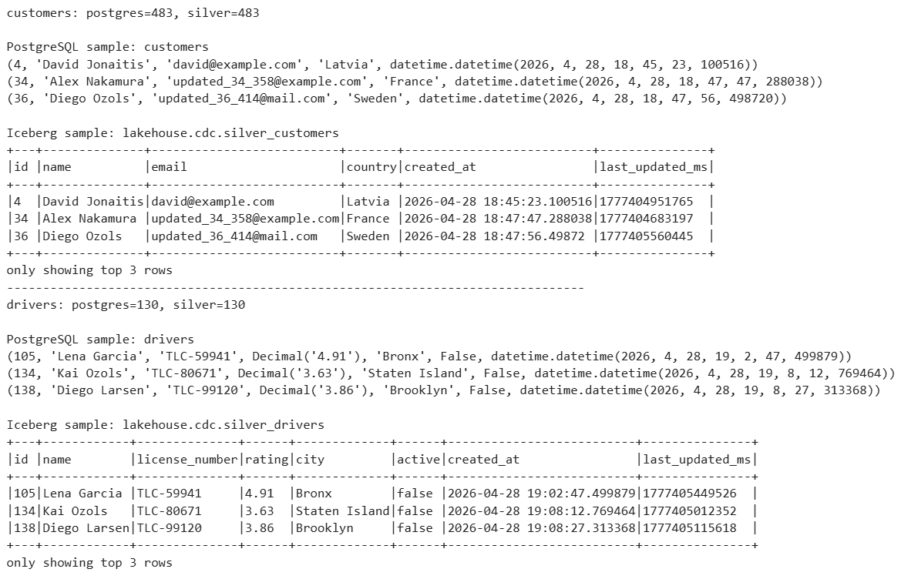
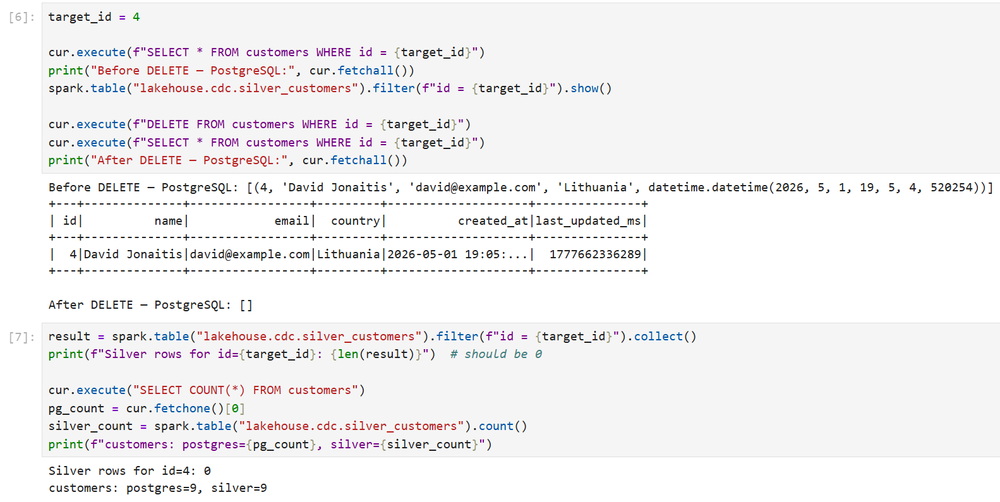
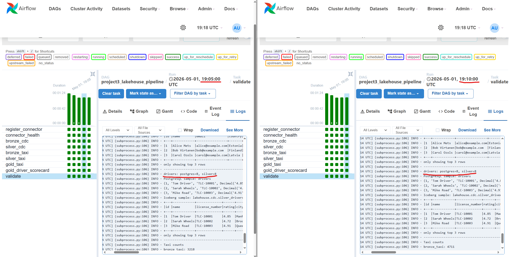
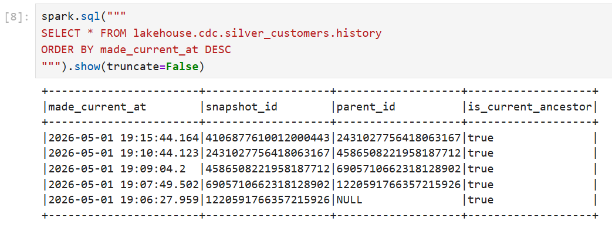
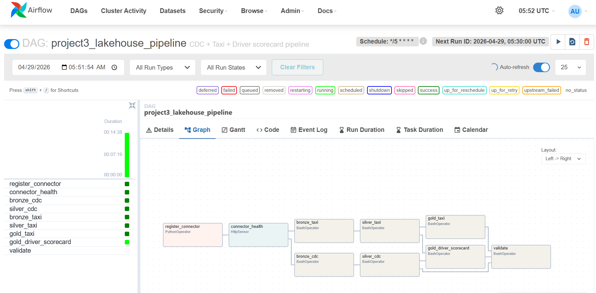
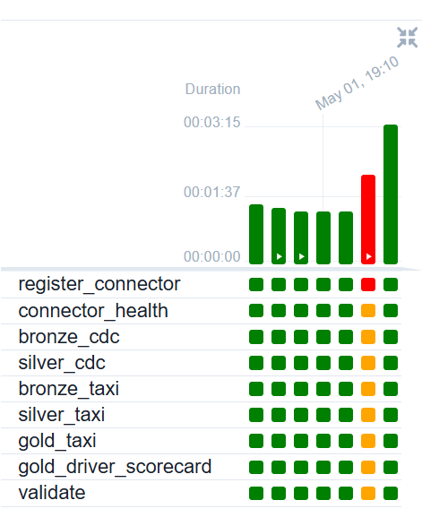
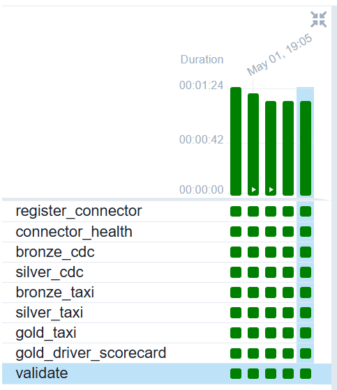

# Project 3 — CDC + Orchestrated Lakehouse Pipeline

**Group J**

---

## 1. CDC correctness

### Silver mirrors PostgreSQL

Row counts and spot-checked rows match exactly between the PostgreSQL source and the Silver Iceberg tables.



### DELETEs are reflected in Silver

A specific row was deleted from the `customers` table in PostgreSQL. After the next DAG run, the row is absent from `silver_customers`.



### Idempotency

The DAG was triggered twice consecutively with no new changes in PostgreSQL or Kafka. Row counts in Silver were identical across both runs.



**Why it is idempotent:** Bronze ingestion uses a left-anti join on `(topic, partition, offset)` — already-seen Kafka offsets are skipped. Silver uses `MERGE INTO` driven by a stage that always selects the single latest event per `record_id` from all of Bronze. With no new Bronze rows, the stage is identical across runs, so the MERGE produces no changes.

---

## 2. Lakehouse design

### Table schemas

**`lakehouse.cdc.bronze_cdc`** — raw CDC event log, append-only, partitioned by `source_table`

| Column | Type | Notes |
|---|---|---|
| source_table | STRING | `customers` or `drivers` |
| record_id | INT | primary key of the changed row |
| op | STRING | `c`, `u`, `d`, `r` |
| before_json | STRING | full row before change |
| after_json | STRING | full row after change |
| source_lsn | BIGINT | WAL log sequence number |
| source_snapshot | STRING | snapshot phase flag |
| ts_ms | BIGINT | event timestamp (ms) |
| kafka_key | STRING | raw Kafka message key |
| raw_value | STRING | raw Kafka message value |
| topic | STRING | Kafka topic |
| kafka_partition | INT | |
| kafka_offset | BIGINT | |
| kafka_timestamp | TIMESTAMP | |
| is_tombstone | BOOLEAN | true for null-value delete markers |
| bronze_ingested_at | TIMESTAMP | ingest time |

**`lakehouse.cdc.silver_customers`** — current-state mirror of `public.customers`

| Column | Type |
|---|---|
| id | INT |
| name | STRING |
| email | STRING |
| country | STRING |
| created_at | TIMESTAMP |
| last_updated_ms | BIGINT |

**`lakehouse.cdc.silver_drivers`** — current-state mirror of `public.drivers`

| Column | Type |
|---|---|
| id | INT |
| name | STRING |
| license_number | STRING |
| rating | DOUBLE |
| city | STRING |
| active | BOOLEAN |
| created_at | TIMESTAMP |
| last_updated_ms | BIGINT |

**`lakehouse.taxi.bronze_taxi`** — raw taxi Kafka messages, append-only, partitioned by `days(kafka_timestamp)`

| Column | Type |
|---|---|
| kafka_key | STRING |
| raw_json | STRING |
| topic | STRING |
| kafka_partition | INT |
| kafka_offset | BIGINT |
| kafka_timestamp | TIMESTAMP |
| bronze_ingested_at | TIMESTAMP |

**`lakehouse.taxi.silver_taxi`** — parsed, cleaned, enriched taxi trips, partitioned by `pickup_date`

| Column | Type |
|---|---|
| trip_id | STRING |
| vendor_id | INT |
| pickup_ts / dropoff_ts | TIMESTAMP |
| pickup_date | DATE |
| pickup_hour | INT |
| trip_duration_minutes | DOUBLE |
| passenger_count | INT |
| trip_distance | DOUBLE |
| pu_location_id / do_location_id | INT |
| pickup_zone / pickup_borough | STRING |
| dropoff_zone / dropoff_borough | STRING |
| fare_amount / tip_amount / total_amount | DOUBLE |
| payment_type | INT |
| congestion_surcharge | DOUBLE |
| raw_json | STRING |

**`lakehouse.taxi.gold_taxi_hourly_zone`** — hourly aggregations by pickup zone, partitioned by `pickup_date`

| Column | Type |
|---|---|
| pickup_date | DATE |
| pickup_hour | INT |
| pickup_zone | STRING |
| trip_count | BIGINT |
| avg_fare_amount | DOUBLE |
| avg_total_amount | DOUBLE |
| avg_trip_distance | DOUBLE |
| avg_trip_duration_minutes | DOUBLE |

**Why each layer differs:** Bronze stores every raw event unchanged — it is the immutable audit log. Silver for CDC collapses the event log into one current row per entity, applying deletes. Silver for taxi parses and validates raw JSON, drops invalid trips, and enriches with zone names. Gold aggregates Silver into summary statistics, discarding row-level detail.

### Iceberg snapshot history — Silver CDC

Each DAG run that produces changes creates a new Iceberg snapshot on the Silver tables. The history shows one snapshot per MERGE.



### Time travel

To read Silver at the state before a specific MERGE, use the snapshot id from the history table:

```sql
SELECT * FROM lakehouse.cdc.silver_customers VERSION AS OF <snapshot_id_before_merge> LIMIT 10;
```

To roll back a bad MERGE, call `CALL lakehouse.system.rollback_to_snapshot` with the target snapshot id:

```sql
CALL lakehouse.system.rollback_to_snapshot('lakehouse.cdc.silver_customers', <snapshot_id_before_merge>);
```

---

## 3. Orchestration design

### DAG graph



### Task dependency chain

```
register_connector
    └── connector_health
            ├── bronze_cdc ──── silver_cdc ──────────────────────────┐
            │                                                          ├── gold_driver_scorecard ──┐
            └── bronze_taxi ─── silver_taxi ──┬─ gold_taxi ──────────┘                            ├── validate
                                              └────────────────────────── (also feeds scorecard) ──┘
```

- `register_connector` creates or updates the Debezium connector via the Kafka Connect REST API.
- `connector_health` is an HTTP sensor that polls until the connector reports `RUNNING`. All downstream tasks depend on it — if it fails, the entire DAG stops.
- `bronze_cdc` and `bronze_taxi` read from Kafka independently and can run in parallel.
- `silver_cdc` and `silver_taxi` each MERGE from their respective bronze tables.
- `gold_driver_scorecard` joins Silver driver data with Silver taxi trips and depends on both.
- `gold_taxi` aggregates Silver taxi data independently.
- `validate` runs last and checks that Silver CDC row counts match PostgreSQL.

### Scheduling strategy

The DAG runs every 5 minutes (`*/5 * * * *`). This supports a freshness SLA of 5 minutes — any change committed to PostgreSQL will be reflected in Silver within one DAG cycle. `max_active_runs=1` prevents overlapping runs.

### Retry and failure handling

Each task has `retries=1` with a 2-minute retry delay and a 30-minute execution timeout. If a task fails and the retry also fails, all downstream tasks enter `upstream_failed` state and are skipped.



### DAG run history



### Backfill

`catchup=False` means Airflow does not automatically backfill missed intervals. Because all jobs are idempotent — Bronze deduplicates by Kafka offset, Silver uses MERGE, Gold uses `overwritePartitions` — manually re-triggering the DAG for any past interval produces the same result as the original run.

## 4. Streaming pipeline (taxi)

- Show that the taxi bronze/silver/gold pipeline works correctly (same criteria as Project 2).
- Show improvements over Project 2 based on feedback.

## 5. Custom scenario

- Explain and/or show how you solved the custom scenario from the GitHub issue.
