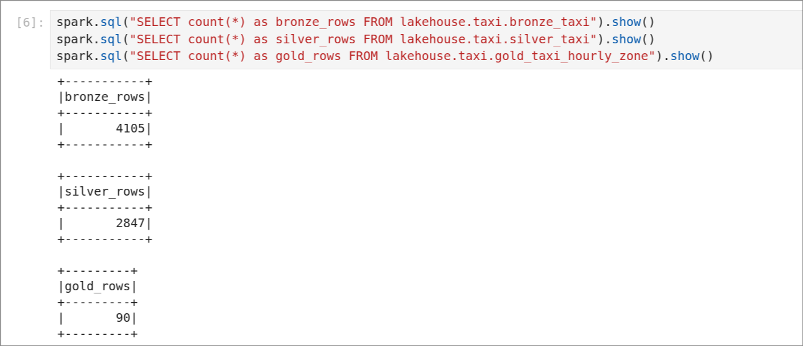
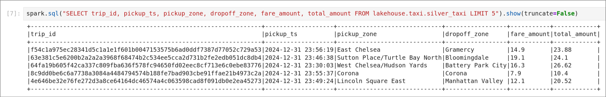
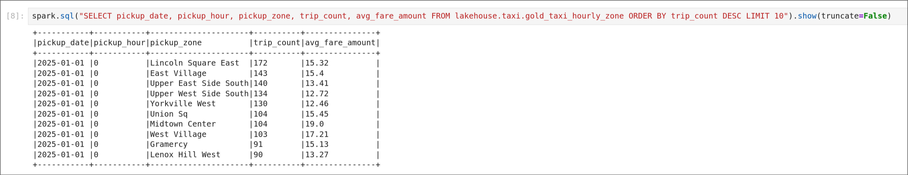
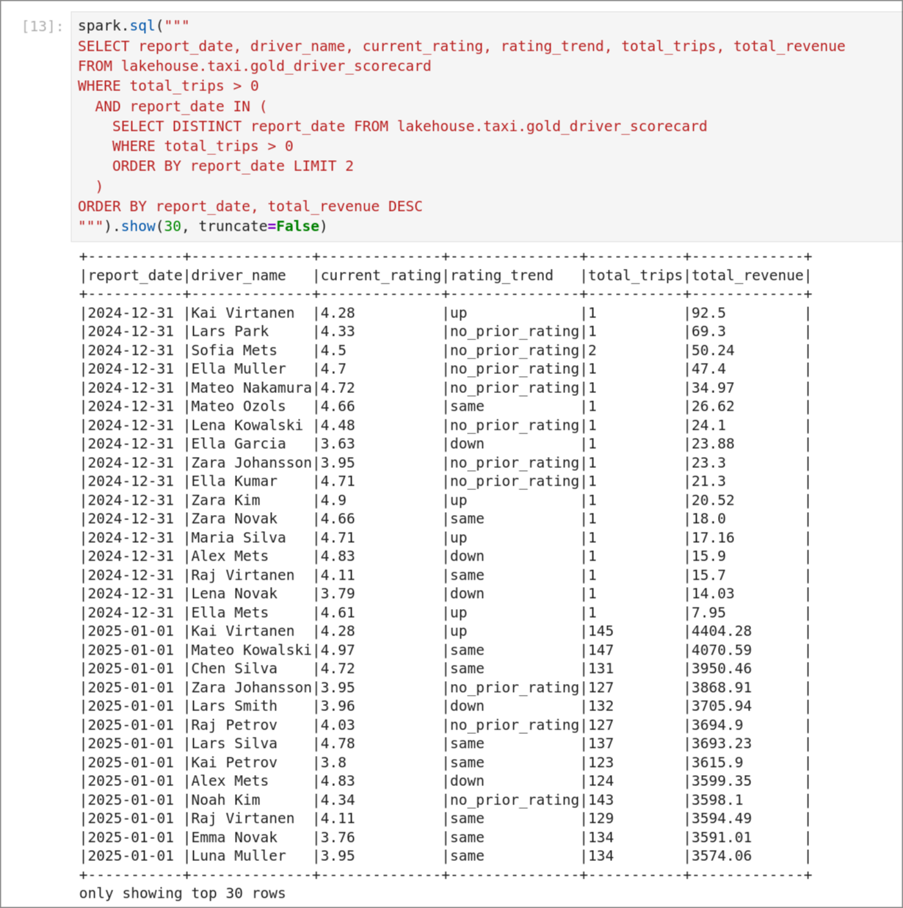
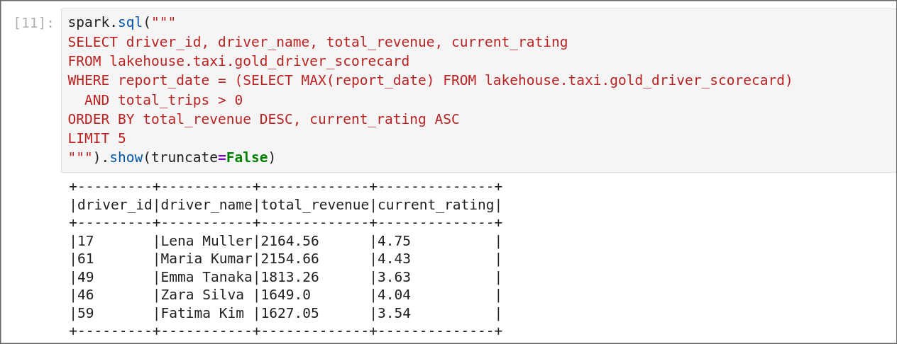

# Project 3 — CDC + Orchestrated Lakehouse Pipeline

**Group J**

---

## 1. CDC correctness

### Silver mirrors PostgreSQL

Row counts and spot-checked rows match exactly between the PostgreSQL source and the Silver Iceberg tables.


### DELETEs are reflected in Silver

A specific row was deleted from the `customers` table in PostgreSQL. After the next DAG run, the row is absent from `silver_customers`.


### Idempotency

The DAG was triggered twice consecutively with no new changes in PostgreSQL or Kafka. Row counts in Silver were identical across both runs.


**MERGE logic:** `op = 'd'` → DELETE the row from Silver. `op in ('c', 'u', 'r')` → UPDATE the row if it already exists, INSERT it if not.

**Why it is idempotent:** Bronze ingestion uses a left-anti join on `(topic, partition, offset)` — already-seen Kafka offsets are skipped. Silver uses `MERGE INTO` driven by a stage that always selects the single latest event per `record_id` from all of Bronze. With no new Bronze rows, the stage is identical across runs, so the MERGE produces no changes.

---

## 2. Lakehouse design

### Table schemas

**`lakehouse.cdc.bronze_cdc`** — raw CDC event log, append-only, partitioned by `source_table`

| Column | Type | Notes |
|---|---|---|
| source_table | STRING | `customers` or `drivers` |
| record_id | INT | primary key of the changed row |
| op | STRING | `c`, `u`, `d`, `r` |
| before_json | STRING | full row before change |
| after_json | STRING | full row after change |
| source_lsn | BIGINT | WAL log sequence number |
| source_snapshot | STRING | snapshot phase flag |
| ts_ms | BIGINT | event timestamp (ms) |
| kafka_key | STRING | raw Kafka message key |
| raw_value | STRING | raw Kafka message value |
| topic | STRING | Kafka topic |
| kafka_partition | INT | |
| kafka_offset | BIGINT | |
| kafka_timestamp | TIMESTAMP | |
| is_tombstone | BOOLEAN | true for null-value delete markers |
| bronze_ingested_at | TIMESTAMP | ingest time |

**`lakehouse.cdc.silver_customers`** — current-state mirror of `public.customers`

| Column | Type |
|---|---|
| id | INT |
| name | STRING |
| email | STRING |
| country | STRING |
| created_at | TIMESTAMP |
| last_updated_ms | BIGINT |

**`lakehouse.cdc.silver_drivers`** — current-state mirror of `public.drivers`

| Column | Type |
|---|---|
| id | INT |
| name | STRING |
| license_number | STRING |
| rating | DOUBLE |
| city | STRING |
| active | BOOLEAN |
| created_at | TIMESTAMP |
| last_updated_ms | BIGINT |

**`lakehouse.taxi.bronze_taxi`** — raw taxi Kafka messages, append-only, partitioned by `days(kafka_timestamp)`

| Column | Type |
|---|---|
| kafka_key | STRING |
| raw_json | STRING |
| topic | STRING |
| kafka_partition | INT |
| kafka_offset | BIGINT |
| kafka_timestamp | TIMESTAMP |
| bronze_ingested_at | TIMESTAMP |

**`lakehouse.taxi.silver_taxi`** — parsed, cleaned, enriched taxi trips, partitioned by `pickup_date`

| Column | Type |
|---|---|
| trip_id | STRING |
| vendor_id | INT |
| pickup_ts / dropoff_ts | TIMESTAMP |
| pickup_date | DATE |
| pickup_hour | INT |
| trip_duration_minutes | DOUBLE |
| passenger_count | INT |
| trip_distance | DOUBLE |
| pu_location_id / do_location_id | INT |
| pickup_zone / pickup_borough | STRING |
| dropoff_zone / dropoff_borough | STRING |
| fare_amount / tip_amount / total_amount | DOUBLE |
| payment_type | INT |
| congestion_surcharge | DOUBLE |
| raw_json | STRING |

**`lakehouse.taxi.gold_taxi_hourly_zone`** — hourly aggregations by pickup zone, partitioned by `pickup_date`

| Column | Type |
|---|---|
| pickup_date | DATE |
| pickup_hour | INT |
| pickup_zone | STRING |
| trip_count | BIGINT |
| avg_fare_amount | DOUBLE |
| avg_total_amount | DOUBLE |
| avg_trip_distance | DOUBLE |
| avg_trip_duration_minutes | DOUBLE |

**`lakehouse.taxi.gold_driver_scorecard`** — daily driver performance report, partitioned by `report_date`

| Column | Type | Notes |
|---|---|---|
| report_date | DATE | Trip pickup date |
| driver_id | INT | From `silver_drivers` |
| driver_name | STRING | |
| license_number | STRING | |
| city | STRING | |
| active | BOOLEAN | |
| current_rating | DOUBLE | Latest rating from `silver_drivers` |
| previous_rating | DOUBLE | Second-most-recent rating from `bronze_cdc` |
| rating_trend | STRING | `up`, `down`, `same`, `no_prior_rating` |
| total_trips | BIGINT | Trips assigned to this driver on this date |
| avg_fare_per_trip | DOUBLE | |
| avg_trip_distance | DOUBLE | |
| total_revenue | DOUBLE | Sum of `total_amount` for assigned trips |

**Why each layer differs:** Bronze stores every raw event unchanged — it is the immutable audit log. Silver for CDC collapses the event log into one current row per entity, applying deletes. Silver for taxi parses and validates raw JSON, drops invalid trips, and enriches with zone names. Gold aggregates Silver into summary statistics, discarding row-level detail.

### Iceberg snapshot history — Silver CDC

Each DAG run that produces changes creates a new Iceberg snapshot on the Silver tables. The history shows one snapshot per MERGE.


### Time travel

To read Silver at the state before a specific MERGE, use the snapshot id from the history table:

```sql
SELECT * FROM lakehouse.cdc.silver_customers VERSION AS OF <snapshot_id_before_merge> LIMIT 10;
```

To roll back a bad MERGE, call `CALL lakehouse.system.rollback_to_snapshot` with the target snapshot id:

```sql
CALL lakehouse.system.rollback_to_snapshot('lakehouse.cdc.silver_customers', <snapshot_id_before_merge>);
```

---

## 3. Orchestration design

### DAG graph


### Task dependency chain

```
register_connector
    └── connector_health
            ├── bronze_cdc ──── silver_cdc ──────────────────────────┐
            │                                                          ├── gold_driver_scorecard ──┐
            └── bronze_taxi ─── silver_taxi ──┬─ gold_taxi ──────────┘                            ├── validate
                                              └────────────────────────── (also feeds scorecard) ──┘
```

- `register_connector` creates or updates the Debezium connector via the Kafka Connect REST API.
- `connector_health` is an HTTP sensor that polls until the connector reports `RUNNING`. All downstream tasks depend on it — if it fails, the entire DAG stops.
- `bronze_cdc` and `bronze_taxi` read from Kafka independently and can run in parallel.
- `silver_cdc` and `silver_taxi` each MERGE from their respective bronze tables.
- `gold_driver_scorecard` joins Silver driver data with Silver taxi trips and depends on both.
- `gold_taxi` aggregates Silver taxi data independently.
- `validate` runs last and checks that Silver CDC row counts match PostgreSQL.

### Scheduling strategy

The DAG runs every 5 minutes (`*/5 * * * *`). This supports a freshness SLA of 5 minutes — any change committed to PostgreSQL will be reflected in Silver within one DAG cycle. `max_active_runs=1` prevents overlapping runs.

### Retry and failure handling

Each task has `retries=1` with a 2-minute retry delay and a 30-minute execution timeout. If a task fails and the retry also fails, all downstream tasks enter `upstream_failed` state and are skipped.


### DAG run history


### Backfill

`catchup=False` means Airflow does not automatically backfill missed intervals. Because all jobs are idempotent — Bronze deduplicates by Kafka offset, Silver uses MERGE, Gold uses `overwritePartitions` — manually re-triggering the DAG for any past interval produces the same result as the original run.

## 4. Streaming pipeline (taxi)

### Table row counts

Bronze ingested 4,105 raw Kafka messages. Silver retained 2,847 after validation filters dropped invalid trips (~31%). Gold produced 90 aggregated rows across date/hour/zone combinations.



### Silver — parsed and enriched

Silver trips have SHA-256 `trip_id`, parsed `pickup_ts`/`dropoff_ts` timestamps, and pickup/dropoff zone names enriched from the zone lookup table.



### Gold — hourly aggregation by zone

Gold aggregates by `(pickup_date, pickup_hour, pickup_zone)` producing trip counts and average fares. The busiest zones on 2025-01-01 at midnight were Lincoln Square East (172 trips, avg $15.32) and East Village (143 trips, avg $15.40).



### Improvement over Project 2

Project 2 used Spark Structured Streaming running continuously with a 10-second micro-batch trigger and checkpoint-based deduplication (`dropDuplicates` within each micro-batch). This meant a trip arriving across two different micro-batches could be inserted twice on restart.

Project 3 makes the following improvements:

1. **Global idempotency via MERGE INTO** — Silver uses `MERGE INTO silver_taxi ON trip_id`. The SHA-256 `trip_id` is derived from the trip's content, so re-running the job for any set of Kafka offsets produces zero new rows if the data has already been processed.
2. **Batch jobs triggered by Airflow** — the pipeline is now a scheduled batch job with `retries=1`, a 30-minute execution timeout, and explicit task dependencies, replacing the always-on streaming process.
3. **Stricter validation** — Project 3 adds a trip duration bounds check (`(0, 720]` minutes) that was missing in Project 2, and confirms all monetary fields are non-negative.
4. **Richer Gold aggregation** — Project 2 Gold only counted peak vs non-peak trips. Project 3 Gold adds `avg_fare_amount`, `avg_total_amount`, `avg_trip_distance`, and `avg_trip_duration_minutes`, and is partitioned by `pickup_date` for efficient time-range queries.

## 5. Custom scenario

The custom scenario required building a `gold_driver_scorecard` table combining CDC driver data with taxi trip data to produce a daily driver performance report.

### Implementation

**Trip-to-driver assignment** is deterministic: each trip is assigned to a driver slot using `xxhash64(trip_id) % driver_count`. The same trip always maps to the same driver regardless of when the job runs, making the scorecard idempotent.

**Rating trend** is derived from `bronze_cdc` history: the two most recent rating events per driver are extracted using `ROW_NUMBER() OVER (PARTITION BY driver_id ORDER BY ts_ms DESC)`. Comparing rank-1 (current) against rank-2 (previous) produces `up`, `down`, `same`, or `no_prior_rating`.

**Driver coverage** is guaranteed by cross-joining `silver_drivers` with all distinct `report_date` values from `silver_taxi`. Drivers with no trips on a given date receive `total_trips = 0` and zero revenue.

The task sits downstream of both `silver_cdc` and `silver_taxi` in the DAG, ensuring it always uses the latest driver ratings and trip data.

### Gold driver scorecard — multiple days of data



### Query: driver with most revenue and lowest rating

The query finds the top-revenue drivers on the most recent report date, ordered by revenue descending and rating ascending so the highest earner with the lowest rating surfaces first.

```sql
SELECT driver_id, driver_name, total_revenue, current_rating
FROM lakehouse.taxi.gold_driver_scorecard
WHERE report_date = (SELECT MAX(report_date) FROM lakehouse.taxi.gold_driver_scorecard)
  AND total_trips > 0
ORDER BY total_revenue DESC, current_rating ASC
LIMIT 5;
```



### Rating change propagation

When a driver's rating is updated in PostgreSQL, Debezium captures the WAL event and writes it to `bronze_cdc` on the next DAG run. `silver_cdc` MERGEs the new rating into `silver_drivers`. When `gold_driver_scorecard` runs (it depends on `silver_cdc`), it reads the updated `current_rating` from `silver_drivers` and recalculates `rating_trend` by comparing against the second-most-recent event in `bronze_cdc`. The updated scorecard is visible within one 5-minute DAG cycle.
